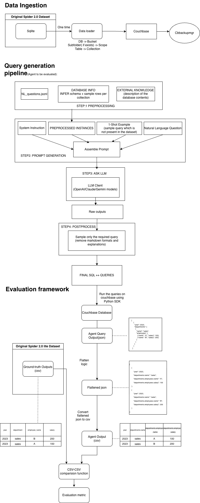

# Introduction:
This repo provides an evaluation pipeline for evaluating an LLM/ Agent on the natural language to N1QL conversion.

# Quick-Start:
# Install and Set-up Couchbase Server following:
https://docs.couchbase.com/server/current/install/install-intro.html

# Loading Data for Spider 2.0
Download the dataset backup zip file from: https://drive.google.com/file/d/1YWkniQnKtf7HapgVA8rFbQjNCFX4dyjo/view?usp=sharing
Unzip the file and restore the data to couchbase using:
```
cbbackupmgr restore \
  --archive /path/to/cb_backups \
  --repo spider2_sqlite_repo \
  --cluster <target_cluster_address> \
  --username <username> \
  --password <password> \
  --auto-create-buckets
  ```
# Architecture

